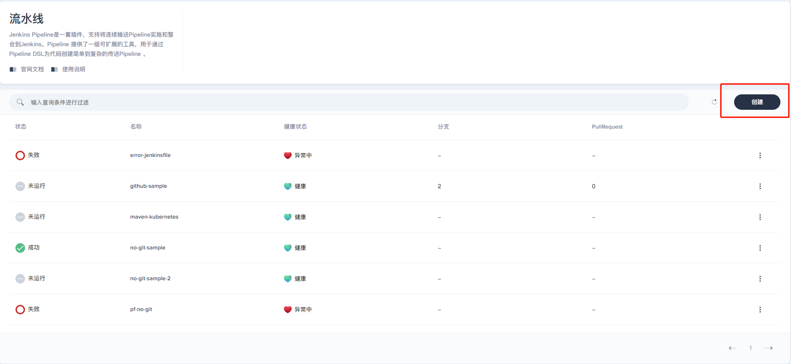
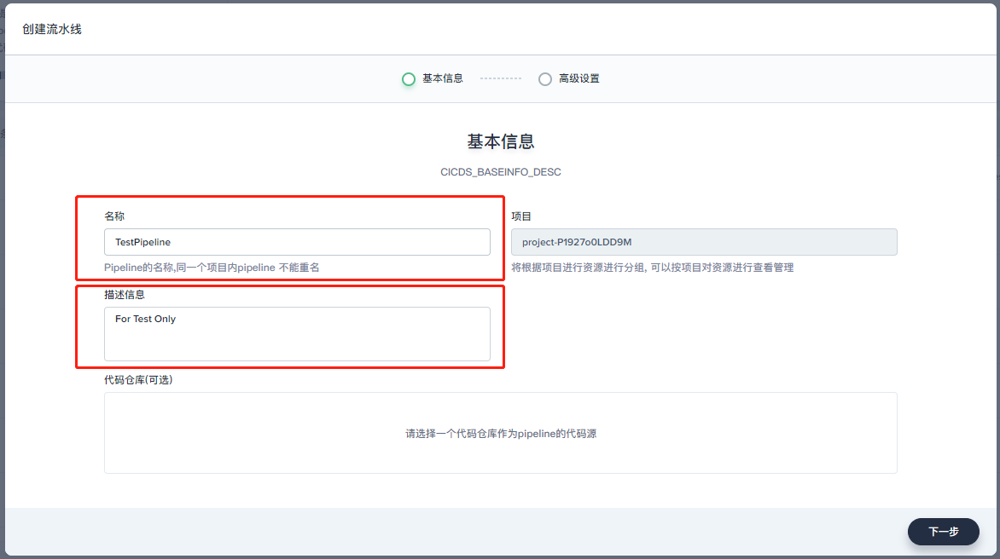
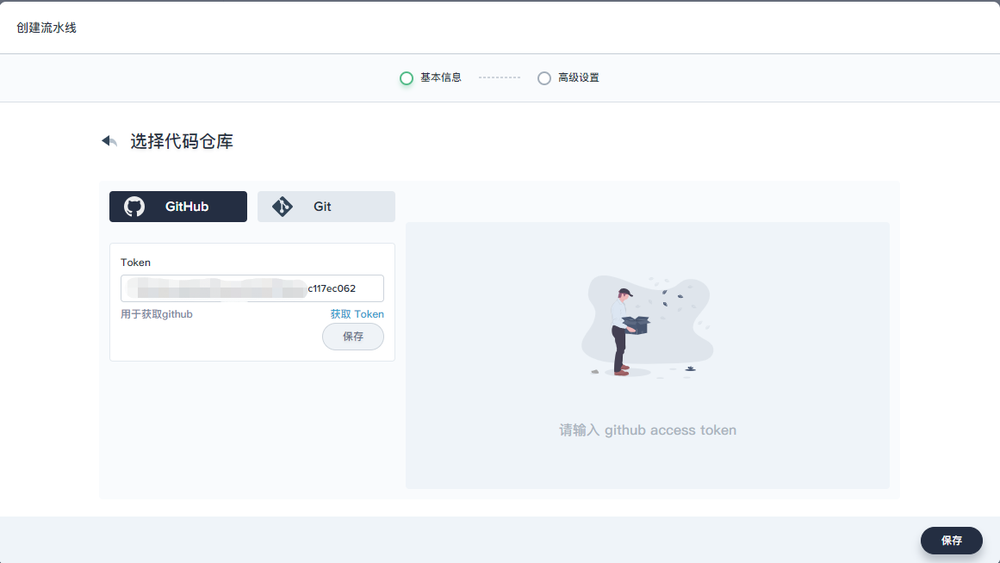
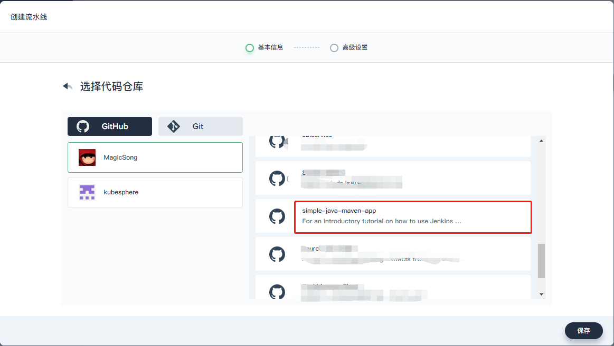
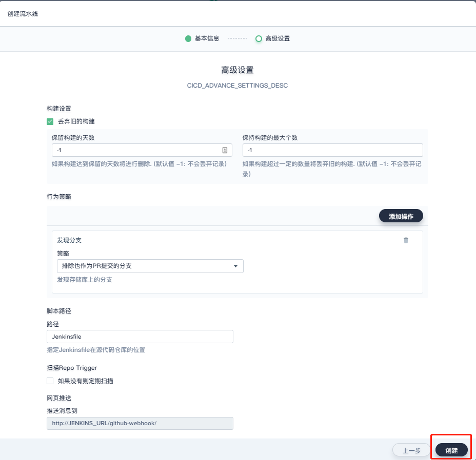
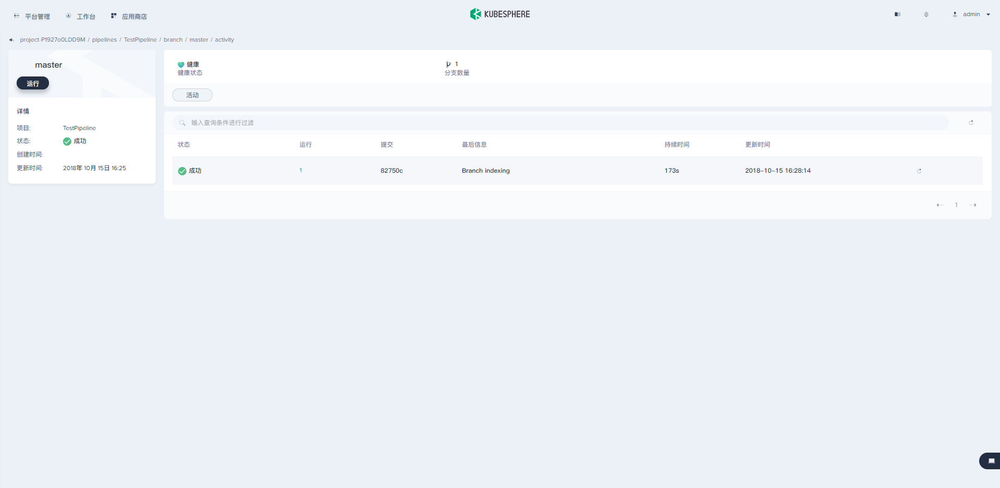
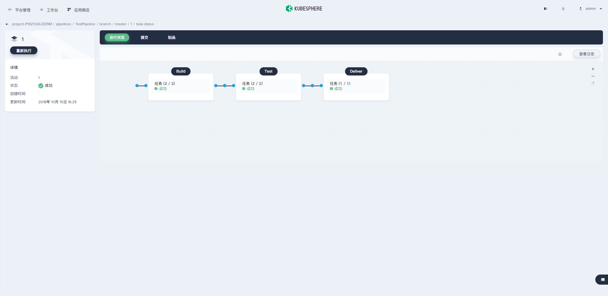
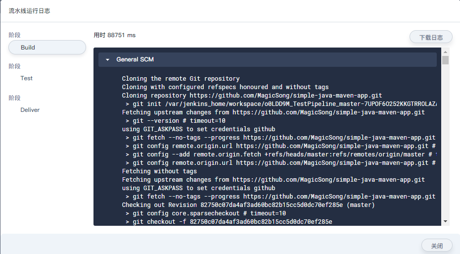
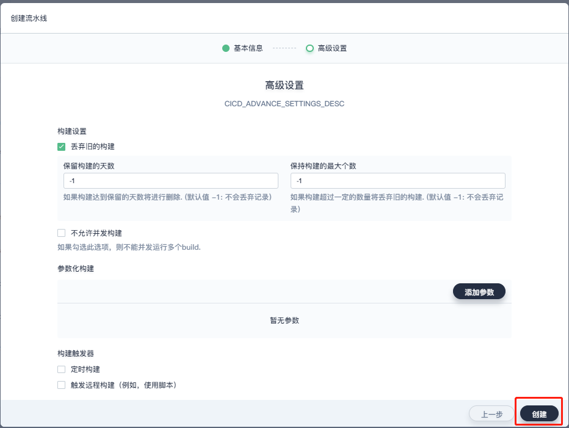
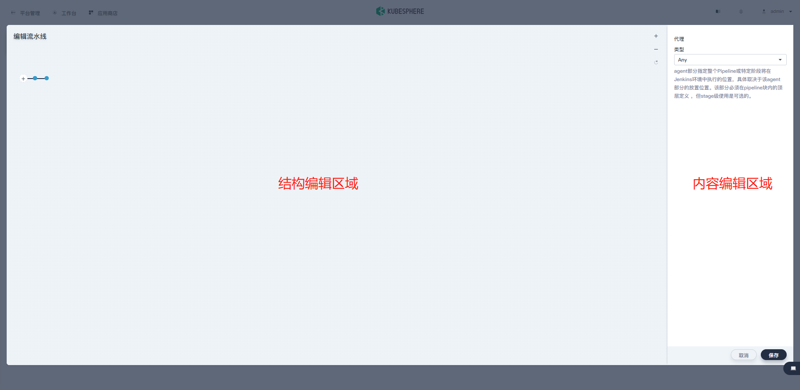

- [Kubesphere Devops指南](#kubesphere-devops指南)
    - [一、快速开始](#一快速开始)
        - [1. 创建DevOPS项目](#1-创建devops项目)
        - [2. 创建流水线](#2-创建流水线)
            - [Jenkinsfile in SCM](#jenkinsfile-in-scm)
            - [Jenkinsfile out of SCM](#jenkinsfile-out-of-scm)
    - [二、基础组件](#二基础组件)
        - [1. 流水线](#1-流水线)
    - [三、高级设置](#三高级设置)
    - [DevOps工程](#devops工程)
        - [1. 创建DevOPS项目](#1-创建devops项目)
        - [2. 成员管理](#2-成员管理)
        - [2. 可视化编辑器](#2-可视化编辑器)
        - [3. 高级配置](#3-高级配置)
    - [凭证](#凭证)

# Kubesphere Devops指南

> DevOps 是一个面向IT运维的工作流，以持续集成（CI）、持续部署（CD）为基础，来优化程式开发、测试、运维等环节。

## 一、快速开始

### 1. 创建DevOPS项目
想要使用Kubesphere的DevOps功能，首先就要创建一个DevOps工程。DevOps工程位于企业空间中，一个企业空间中可以有多个DevOps工程。本节会介绍如何创建一个DevOPS项目，并进行相关的成员配置。

### 2. 创建流水线
#### Jenkinsfile in SCM
> Jenkinsfile in SCM指的是将Jenkinsfile本身也放入SCM（Source Control Management，源代码管理），其他使用`git clone`或者其他类似的命令都能够获取到这个Jenkinsfile，从而能快速使用项目的CI/CD功能。这种模式比较常用。

1. 进入DevOPS项目，进入左边菜单中的流水线。点击右边的创建按钮。
   
   

2. 在跳出的弹框中，输入Pipelined的基本信息，输入完成，不要点击下一步。
   
   

3. 点击代码仓库，选择Github，并输入访问仓库用的access token。
   
   

4. 如果输入token没有错误，在右边会跳出用户的所有代码库，在其中选择一个带有Jenkinsfile的仓库。如果没有此类的仓库，可以是使用我们的测试仓库<https://github.com/MagicSong/simple-java-maven-app.git>。将其Fork到您的仓库中，然后就会在右边的列表中显示。
   
   

5. 完成代码的设置之后，进入高级设置。这里直接跳过，高级设置可参考[3. 高级配置](#3-高级配置)，点击下一步完成Pipeline的创建。
   
   

6. 点击扫描分支，用于获取源代码中的Jenkinsfile。扫描分支会获取仓库的所有分支，并且根据输入的路径寻找Jenkinsfile（默认是根目录下一个名为Jenkinsfile的文件）。等待一段时间，Pipeline就会运行完成。至此就完成了一个Jenkinsfile in SCM的创建。
   
   
   
7. 点击页面中运行序列号，查看运行的具体状态。页面展现了Pipeline中每一个步骤的运行状态，黑色框标注了Pipeline的步骤名称。 
   
   

8. 当前页面中点击右上方的`查看日志`，查看Pipeline运行的日志。页面展示了每一步的具体日志、运行状态以及时间等信息。日志可以下载到本地，如果出现了错误，下载到本地更便于分析。
   
   

#### Jenkinsfile out of SCM
> `Jenkinsfile out of SCM`不同于上面，它的代码仓库中不存储Jenkinsfile，用户需要另外提供Jenkinsfile。由于这种模式代码仓库不存储CI/CD信息，后期维护不方便，所以相比上面一种用的少。

1. 进入一个DevOPS项目，创建一个Pipeline。创建步骤和上面的一样，但是要注意这里不需要选择仓库，让仓库选项为空。
   

2. 点击下一步，同样跳过高级设置（这里的高级设置和上面的有一些差别，因为类型不一样）。点击创建完成Pipeline的创建

   

3. 创建完成之后页面就会自动跳转到编辑Jenkinsfile的页面，在此页面中通过创建Pipeline的每个步骤执行的内容就可以生成Jenkinsfile，用户无需学习Jenkinsfile的语法，非常方便。

   
## 二、基础组件
### 1. 流水线
流水线代表了应用从代码编译、测试、打包和部署的过程，kubesphere的流水线使用了开源界常用的`Jenkinsfile`来表述一组CI/CD流程。Jenkinsfile是一个文本文件，使用了Jenkins提供的DSL（Domain-Specific Language）语法。为了降低学习Jenkinsfile语法的门槛，Kubesphere提供了可视化编辑器，用户只需要在页面上输入一些信息，就能自动组装成Jenkinsfile。用户也可以直接编辑Jenkinsfile，组合我们平台提供的一些功能插件，为更复杂的场景定制高级Pipeline。

## 三、高级设置

##  DevOps工程

### 1. 创建DevOPS项目

### 2. 成员管理

### 2. 可视化编辑器

### 3. 高级配置

## 凭证

